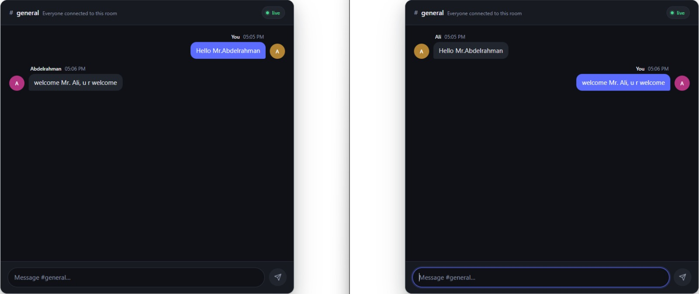
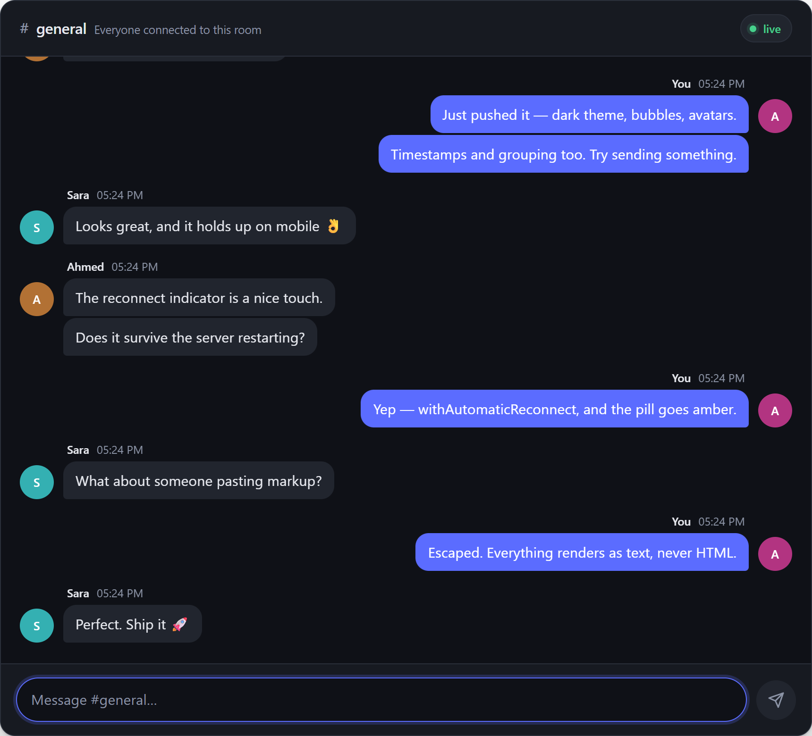
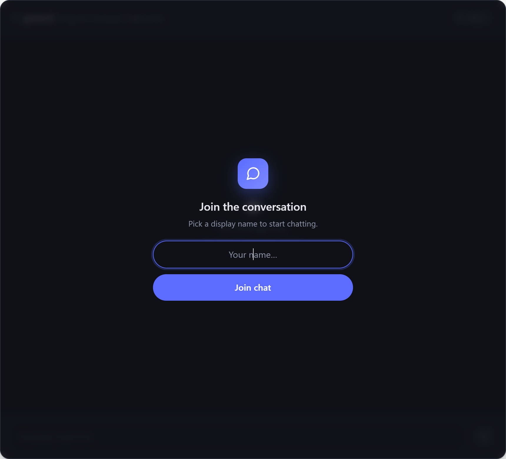
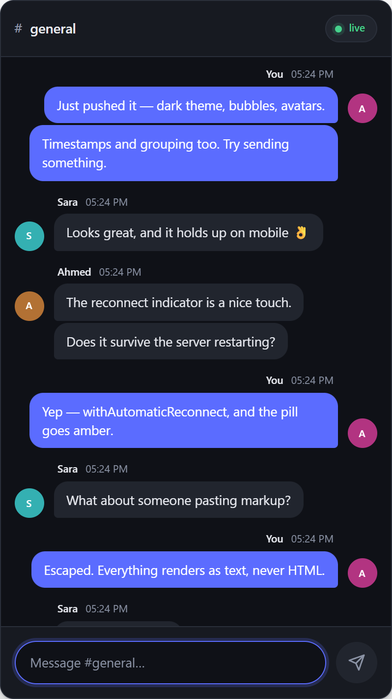

# SignalR Chat

A real-time chat room built with **ASP.NET Core 9 MVC** and **SignalR**, with a dark, modern chat interface. Messages broadcast instantly to every connected client over a WebSocket and are persisted to SQL Server with EF Core.



<p align="center"><em>The same conversation from two connected clients — each sees their own messages on the right.</em></p>

---

## Features

- **Real-time messaging** — SignalR broadcasts every message to all connected clients with no polling.
- **Message bubbles** — your own messages are right-aligned in the accent color, everyone else's on the left.
- **Avatars** — initials with a color derived from a hash of the name, so each person looks consistent.
- **Message grouping** — consecutive messages from the same sender within two minutes collapse together.
- **Connection status** — a live / reconnecting / offline pill in the header, backed by `withAutomaticReconnect()`.
- **Join screen** — pick a display name once; it's remembered in `localStorage` for next time.
- **Safe rendering** — message text is inserted with `textContent`, so pasted markup renders as text and never executes.
- **Responsive** — adapts from desktop down to phone widths.
- **Persistence** — every message is written to SQL Server via EF Core.



<p align="center">
  
  
</p>

<p align="center"><em>The join screen, and the same room at phone width.</em></p>

---

## Tech stack

| Layer | Technology |
|---|---|
| Framework | ASP.NET Core 9 MVC (`net9.0`) |
| Real-time | SignalR (server), `@microsoft/signalr` 6.0.6 (browser) |
| Data | EF Core 9 + SQL Server |
| Frontend | Custom CSS, Bootstrap 5.3.3, jQuery 3.7.1 |

No build tooling is required — no npm, webpack, or Sass. The stylesheet is plain CSS and the client script is inline in the view.

---

## Getting started

### Prerequisites

- [.NET 9 SDK](https://dotnet.microsoft.com/download)
- SQL Server (LocalDB, Express, or full) reachable at `.`

### 1. Clone

```bash
git clone https://github.com/Abdelrahmanm22/SignalR-App.git
cd SignalR-App
```

### 2. Create the database

```sql
CREATE DATABASE Chat;
GO

USE Chat;
GO

CREATE TABLE dbo.messages (
    id         int IDENTITY(1,1) NOT NULL CONSTRAINT PK_messages PRIMARY KEY,
    messagetxt nvarchar(max) NULL,
    username   nvarchar(50)  NULL
);
GO
```

> `id` **must** be `IDENTITY`. The app does not assign ids itself, so a plain `int` primary key makes every insert after the first fail with a duplicate-key violation.

### 3. Check the connection string

`appsettings.json`:

```json
"ConnectionStrings": {
  "DefaultConnection": "Data Source=.;Initial Catalog=Chat;Integrated Security=True;TrustServerCertificate=True"
}
```

Adjust `Data Source` if your SQL Server instance isn't the local default.

### 4. Run

```bash
dotnet run
```

Then open **http://localhost:5050** (or **https://localhost:7119**). The chat is the site root.

To see it work, open a second browser in a private window, join under a different name, and send a message from each.

---

## Project structure

```
Controllers/ChatController.cs   Serves the chat page
Hubs/ChatHub.cs                 SignalR hub, mapped at /chat
Models/message.cs               Entity for the messages table
Models/ChatContext.cs           EF Core DbContext
Views/Chat/Index.cshtml         Chat markup + client script
wwwroot/css/chat.css            All chat styling
docs/                           Screenshots used in this README
```

---

## How it works

The client opens a connection to the hub and registers a handler:

```js
connection = new signalR.HubConnectionBuilder()
    .withUrl("/chat")
    .withAutomaticReconnect()
    .build();

connection.on("newmessage", function (n, m) { addMessage(n, m); });
```

Sending invokes the hub method by name:

```js
connection.invoke("sendmessage", displayName, text);
```

The hub broadcasts to everyone, then saves the row:

```csharp
public void sendmessage(string name, string message)
{
    Clients.All.SendAsync("newmessage", name, message);

    _db.messages.Add(new message { username = name, messagetxt = message });
    _db.SaveChanges();
}
```

The client renders each incoming message into the DOM — building elements and assigning text with `textContent` rather than concatenating HTML.

---

## Known limitations

These are deliberate scope boundaries of the current version, not bugs:

- **No message history.** Saved messages are never loaded on page load, so refreshing clears the visible room. The rows are in the database; nothing reads them back yet.
- **No authentication.** Identity is a display name typed into the join screen and stored client-side. Two people can pick the same name, and the client's "is this mine?" check is a name comparison, so both would see those messages as their own.
- **Timestamps are client arrival times.** The hub sends only `(name, message)`, so each browser stamps messages as they arrive rather than when they were sent.
- **No presence.** There is no online-user list and no join/leave notices — the hub does not track connections.

## Roadmap

- Load recent messages on page load
- Track presence for an online-user list and join/leave notices
- Send a server timestamp and a stable message id over the wire
- `await` the broadcast and save before broadcasting, so a failed insert doesn't reach clients
